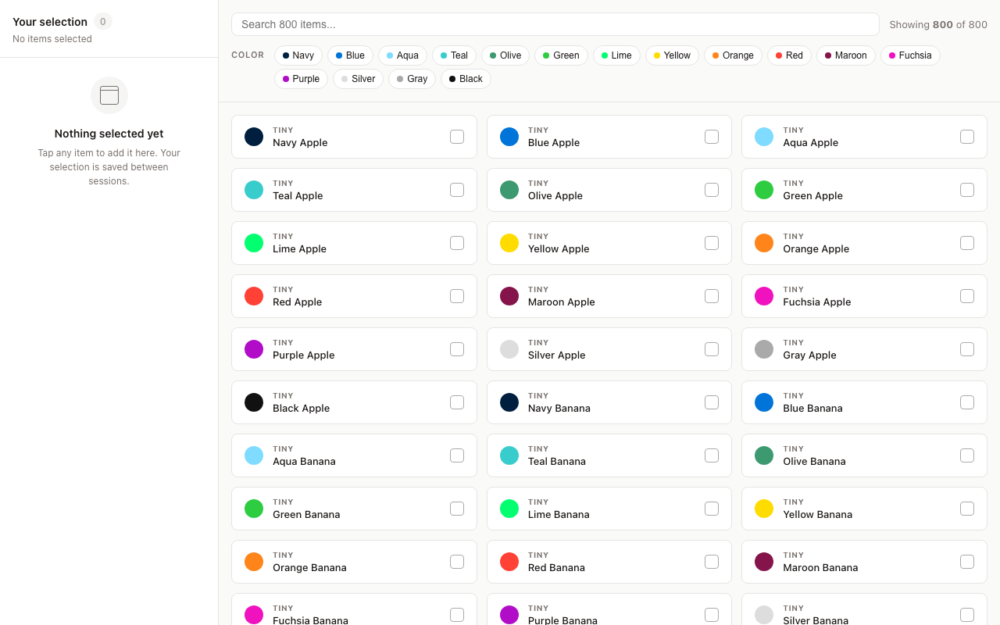
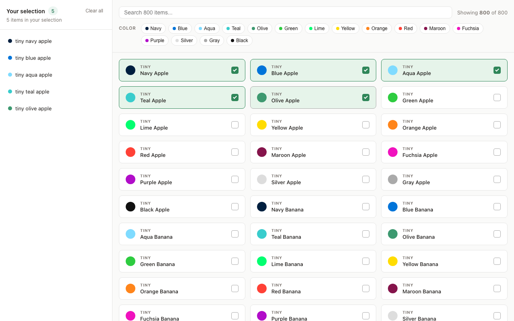
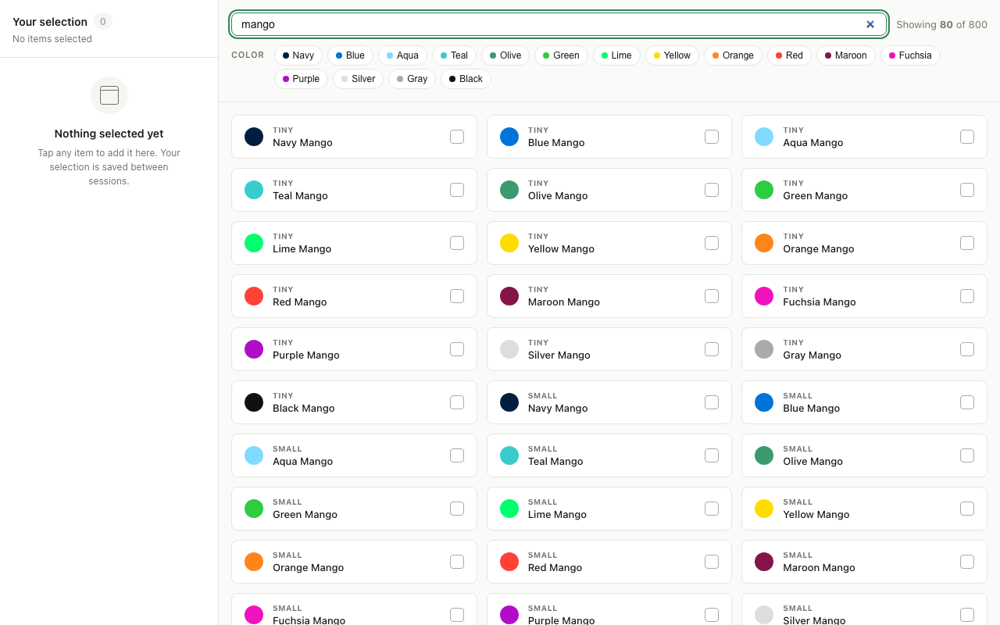
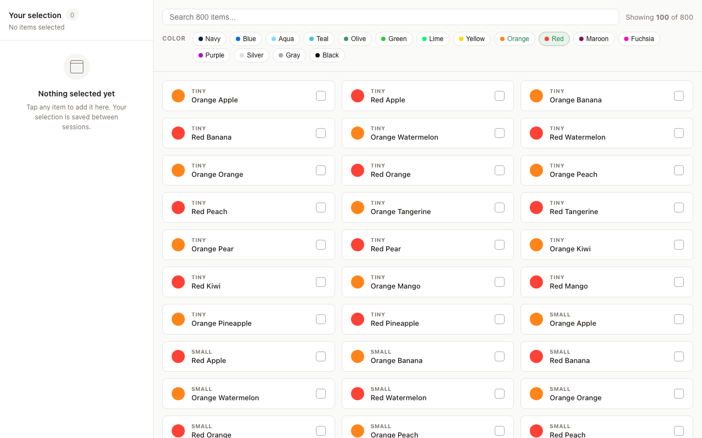
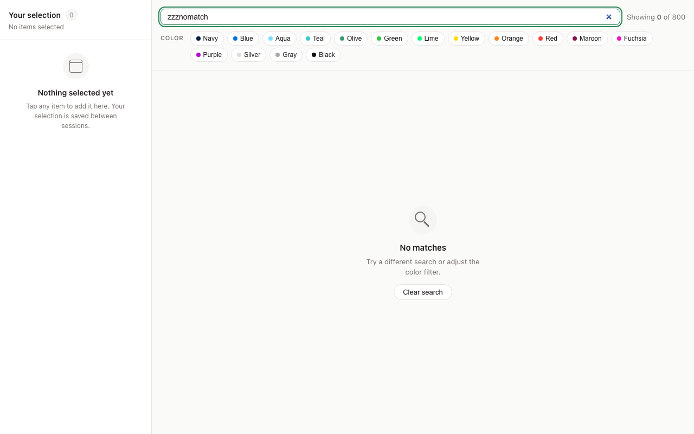
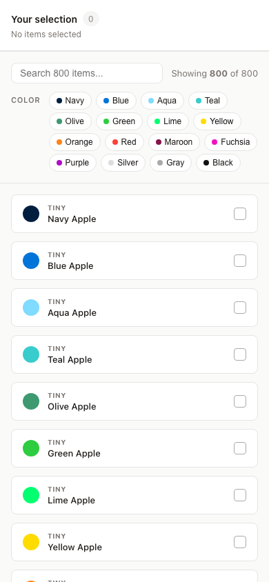
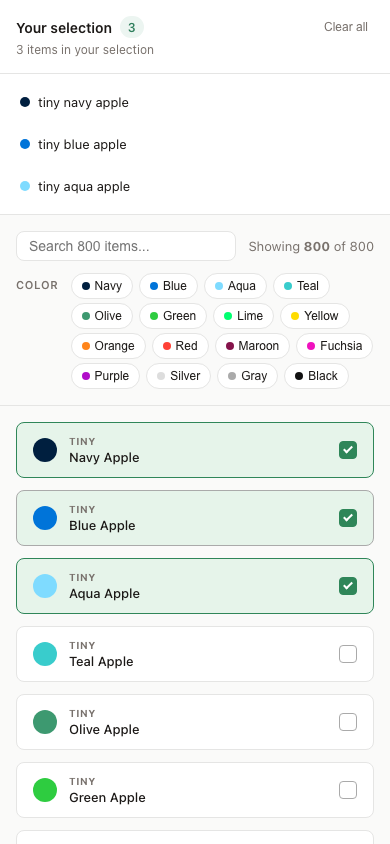

# Pickline — Close Senior Frontend Engineer Assessment

A performant item-picker built with React 19 + TypeScript + Vite.

**Live demo:** https://close-frontend-assessment.vercel.app/

---

## Screenshots

### Desktop — default state


### Desktop — items selected


### Desktop — search


### Desktop — color filter


### Desktop — no results


### Mobile
<table>
  <tr>
    <td align="center"><b>Empty (side rail collapses)</b></td>
    <td align="center"><b>With selection</b></td>
  </tr>
  <tr>
    <td></td>
    <td></td>
  </tr>
</table>

---

## Features

- **Search** — debounced (150 ms) full-text search across 800 items
- **Color filter** — multi-select color badge filters, combinable with search
- **Selection rail** — sidebar that persists your selection to `localStorage` across sessions
- **Clear all** — two-step confirmation before wiping the selection
- **Keyboard navigation** — full roving tabindex on the item grid (Arrow keys, Home/End, Space/Enter, `/` to jump to search, Escape to exit)
- **Accessible** — `listbox`/`option` ARIA roles, `aria-multiselectable`, `aria-live` result count, `:focus-visible` ring
- **Responsive** — stacked single-column on mobile (side rail collapses when empty), 2–4 column grid on desktop

## Stack

- React 19, TypeScript, Vite
- No UI library — all components and icons are hand-rolled CSS

## Local development

```bash
npm install
npm run dev
```

## JSFiddle submission

`jsfiddle.js` is a self-contained Babel + JSX version of the same app for the original challenge submission:

- **HTML panel** — load React 18 UMD scripts + `<div id="root">`
- **CSS panel** — paste `src/App.css`
- **JavaScript panel** — paste `jsfiddle.js`, preprocessor set to **Babel + JSX**

## Regenerating screenshots

```bash
npx playwright install chromium
SCREENSHOT_URL=http://127.0.0.1:4173 npm run screenshots
```

`screenshot.ts` defaults to the deployed Vercel URL, but `SCREENSHOT_URL` lets you point it at a local `npm run dev` or `npm run preview` instance when you want fully reproducible captures.
